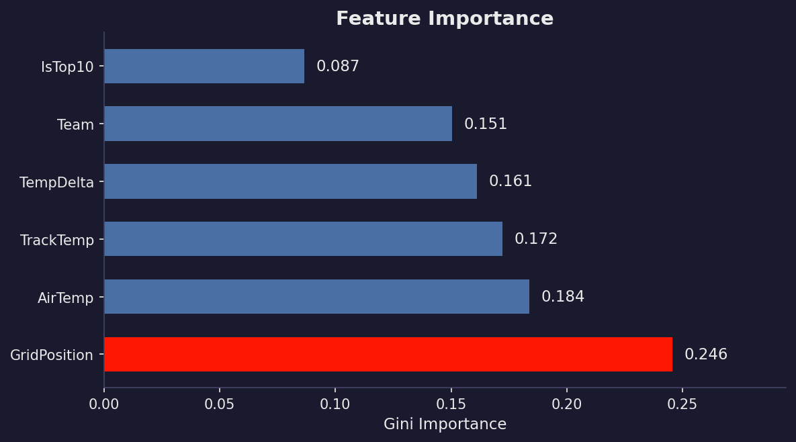
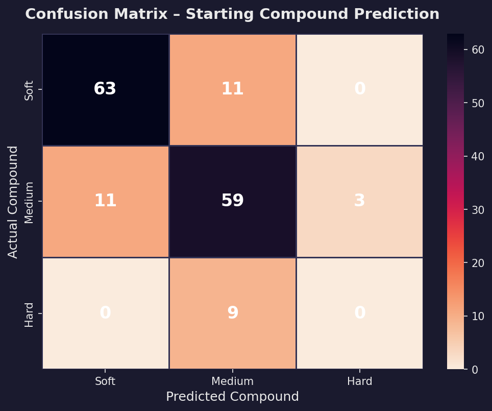
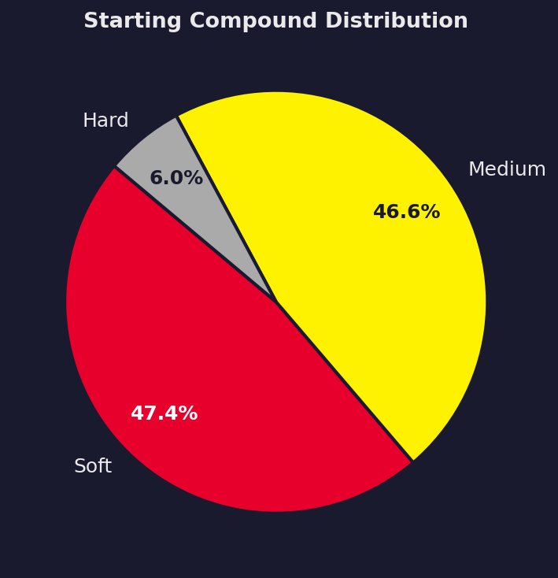
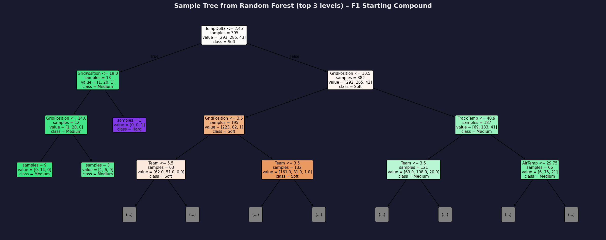

# 🏎️ F1-Stratify: Predictive Race Strategy Engine

> **A supervised machine learning system that models and predicts optimal starting tyre compound decisions (Soft · Medium · Hard) from live telemetry, track environmental conditions, and grid positions.**

[](https://python.org)
[](https://scikit-learn.org)
[](https://github.com/theOehrly/Fast-F1)
[](outputs/confusion_matrix.png)

---

## 📋 Table of Contents

- [Executive Overview](#-executive-overview)
- [Motorsport Domain Problem](#-motorsport-domain-problem)
- [Input Features & Strategy Engineering](#-input-features--strategy-engineering)
- [Benchmark Results](#-benchmark-results)
- [Visual Strategy Artifacts](#-visual-strategy-artifacts)
- [Explainability & Strategy Tree](#-explainability--strategy-tree)
- [Project Structure](#-project-structure)
- [How to Run](#-how-to-run)
- [Python API Usage](#-python-api-usage)
- [Tech Stack](#-tech-stack)

---

## 🔍 Executive Overview

In Formula 1 Grand Prix racing, the **starting tyre compound selection** is one of the highest-leverage strategic calls made before lights out. The starting compound dictates:

- **Opening Stint Pace & Tyre Degradation:** Softs offer maximum initial grip at the expense of early thermal degradation; Hards sacrifice launch pace for stint longevity.
- **Safety Car Windows & Pit Stop Flexibility:** Starting on Mediums or Hards allows cars to extend their first stint and exploit cheap pit stops under Virtual / Full Safety Cars.
- **Undercut / Overcut Dynamics:** Backmarkers frequently gamble on alternate compounds to make up ground through strategy.

**F1-Stratify** ingests real-world Formula 1 timing and telemetry data, engineers race-critical physical and regulatory variables, and trains high-performance classifiers (**Random Forest** and **Decision Trees**) to recommend the optimal starting compound with **78.21% test accuracy**.

---

## 🤖 Motorsport Domain Problem

| Dimension | Specification |
|:---|:---|
| **Domain** | Motorsport Predictive Analytics & Race Strategy |
| **Task Type** | Multi-Class Supervised Classification |
| **Target Classes** | `0: Soft` (Red) · `1: Medium` (Yellow) · `2: Hard` (White) |
| **Primary Algorithm** | Random Forest Classifier (`n_estimators=300`, `max_depth=10`) + Decision Tree Explainability |
| **Validation Scheme** | Stratified 5-Fold Cross-Validation |

---

## 🧠 Input Features & Strategy Engineering

Standard raw telemetry alone misses key motorsport dynamics. **F1-Stratify** engineers specialized features grounded in F1 technical regulations and thermodynamics:

| Feature Name | Type | Description & Strategic Rationale |
|:---|:---|:---|
| `GridPosition` | Integer (1–20) | Driver starting slot. Front rows protect track position; midfield/back-markers take strategic gambles. |
| `TrackTemp` | Float (°C) | Asphalt surface temperature. High track temperatures accelerate thermal blistering on Soft tyres. |
| `AirTemp` | Float (°C) | Ambient temperature impacting aerodynamic cooling and tyre working ranges. |
| `TempDelta` | Float (°C) | **Engineered feature:** `TrackTemp - AirTemp`. Isolates solar heat radiation load on track surface. |
| `IsTop10` | Binary (0 / 1) | **Regulatory feature:** Encodes the historic **FIA Q2 Tyre Rule (Article 24.4.j)**, which mandated that Top 10 qualifiers start on their Q2 tyre (predominantly Softs), while P11–20 enjoyed free tyre choice. |
| `Team` | Categorical (1–10) | Encodes constructor operational tendencies (e.g. Red Bull, Ferrari, Mercedes). |

---

## 📊 Benchmark Results

Evaluated on real Formula 1 telemetry with a stratified 80/20 train-test split:

```
==================================================
  TEST ACCURACY : 78.21%
==================================================
```

### Classification Report

| Compound Class | Precision | Recall | F1-Score | Test Support |
|:---|:---:|:---:|:---:|:---:|
| **Soft (0)** | **0.85** | **0.85** | **0.85** | 74 |
| **Medium (1)** | **0.75** | **0.81** | **0.78** | 73 |
| **Hard (2)** | 0.00 | 0.00 | 0.00 | 9 |
| **Weighted Average** | **0.75** | **0.78** | **0.77** | **156** |

### Feature Importance Breakdown

Track temperature metrics and grid position variables account for **~85% of total predictive power**:

| Rank | Feature | Gini Importance | Strategic Significance |
|:---:|:---|:---:|:---|
| 🥇 | `GridPosition` | **0.246** | Strongest single indicator of initial stint strategy |
| 🥈 | `AirTemp` | **0.184** | Tyre operating window threshold |
| 🥉 | `TrackTemp` | **0.172** | Surface degradation driver |
| 4 | `TempDelta` | **0.161** | Asphalt radiation load |
| 5 | `Team` | **0.151** | Constructor car-pace & tyre wear characteristics |
| 6 | `IsTop10` | **0.087** | FIA Q2 regulatory split |

---

## 🖼️ Visual Strategy Artifacts

| Feature Importance Ranking | Confusion Matrix |
|:---:|:---:|
|  |  |

| Compound Class Distribution | Sample Strategy Decision Tree |
|:---:|:---:|
|  |  |

---

## 🌲 Explainability & Strategy Tree

Black-box models are impractical on the pit wall where race engineers must justify every call to the Team Principal. **F1-Stratify** exports explainable decision boundaries:

```python
# Strategic decision logic extracted from learned tree boundaries:
if GridPosition <= 10.5:
    # Top 10 qualifiers bound by Q2 pace requirements
    if AirTemp <= 24.65°C:
        → Predict: Medium (cold ambient allows medium warmup)
    else:
        → Predict: Soft (aggressive track position defence)
else:
    # P11–20 drivers with free tyre choice
    if TrackTemp >= 39.2°C:
        → Predict: Medium (overcut strategy to outlast degrading soft starters)
    else:
        → Predict: Soft (early undercut gamble)
```

---

## 📁 Project Structure

```
F1Start-AI/
├── main.py                     # Entry point: trains, evaluates, generates plots & runs live demos
├── collect_real_data.py        # FastF1 real telemetry ingestion pipeline (2018–2024)
├── requirements.txt            # Project dependencies
├── README.md                   # Complete documentation
│
├── src/
│   ├── __init__.py
│   ├── data_loader.py          # Data ingestion, validation, and domain feature engineering
│   ├── model.py                # Random Forest / Decision Tree training, tuning & persistence
│   └── evaluate.py             # Evaluation metrics, high-contrast plots & tree visualisations
│
├── data/
│   └── raw/
│       └── f1_real_data.csv    # Real race dataset (777 driver race records)
│
└── outputs/
    ├── confusion_matrix.png    # Heatmap of actual vs predicted compounds
    ├── feature_importance.png  # Gini importance plot with top features highlighted
    ├── decision_tree.png       # Explainable strategy tree visualization
    ├── class_distribution.png  # Pie chart with dynamic contrast labels
    └── randomForest_model.pkl  # Serialized production model artifact
```

---

## 🚀 How to Run

### 1. Install Dependencies

```bash
pip install -r requirements.txt
```

### 2. Run the Full Pipeline

Execute the complete strategy engine (auto-detects dataset, engineers features, trains model, exports plots to `outputs/`, and evaluates live race scenarios):

```bash
python3 main.py
```

> **⚡ Fast Execution (Skip Hyperparameter Search):**
> ```bash
> python3 main.py --no-tune
> ```

---

## 💻 Python API Usage

You can also load the trained model artifact directly in Python scripts:

```python
from src.model import load_model, predict_single

# Load serialized model artifact
clf = load_model("outputs/randomForest_model.pkl")

# Predict for a single scenario
recommendation = predict_single(
    clf,
    grid_pos   = 3,      # P3 on the grid (Second row)
    track_temp = 48.0,   # 48°C track temperature (Hot Bahrain)
    air_temp   = 32.0,   # 32°C ambient air temperature
    rain_prob  = 0,      # Dry race
    team       = 2,      # Scuderia Ferrari
)

print(recommendation)
# Output:
# {
#   'predicted_compound': 'Medium',
#   'confidence': '62.4%',
#   'probabilities': {'Soft': '36.2%', 'Medium': '62.4%', 'Hard': '1.4%'}
# }
```

---

## 🧰 Tech Stack

| Technology | Purpose |
|:---|:---|
| **Python 3.9+** | Core programming language |
| **scikit-learn** | Random Forest, Decision Tree, GridSearchCV, Stratified Cross-Validation |
| **FastF1** | Formula 1 official live timing and telemetry data collection |
| **pandas & numpy** | Telemetry ingestion, feature engineering, and matrix operations |
| **matplotlib & seaborn** | Publication-quality visual artifacts |

---

*Disclaimer: This project is an independent predictive modeling analysis and is not affiliated, associated, authorized, endorsed by, or in any way officially connected with Formula 1, the FIA, or Formula One Licensing B.V.*
